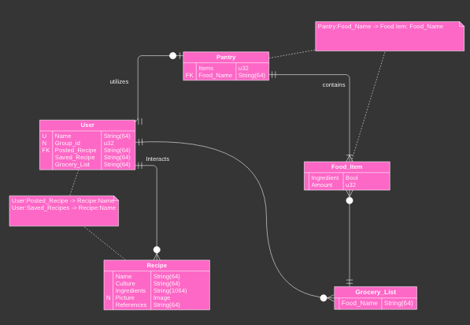
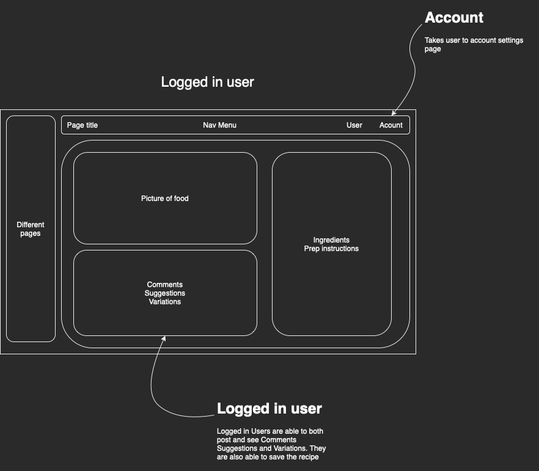
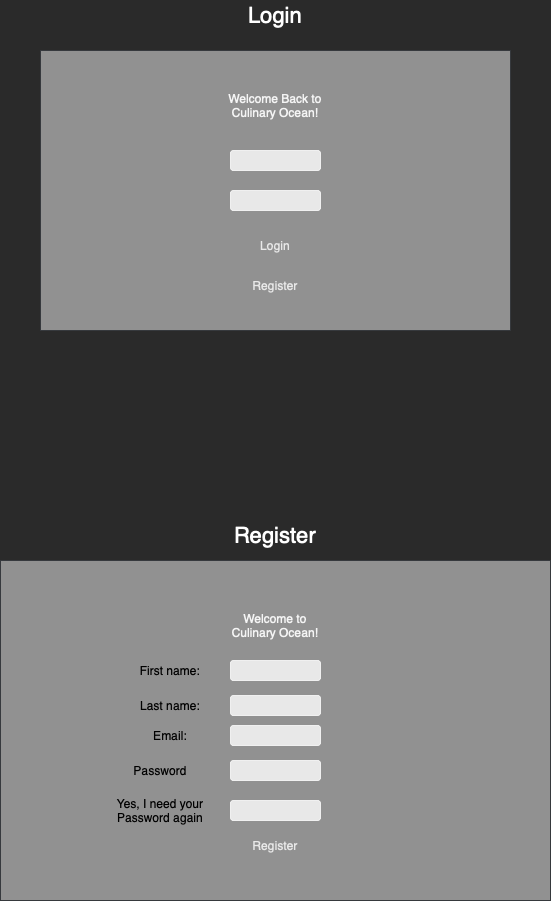

# Culinary Ocean

## Core attributes
- recipe database, cookbook social network.
- individual accounts for each person.
- family/friend groups.
- data: recipes, profiles, food pantry.

## Requirements
- use Vue.js on all pages to auto update
- use django to manage persisting data
- use foundation to style
- use rust wasm for image compression
- use Docker for hosting

## Stack
- Backend: actix-web + Docker + rust-trunk
- Middleware: actix-web/rust
- Frontend: rust-yew + tailwindcss

## Diagrams

database model using StarUML

Wireframe website using draw.io

- DashBoard

- Login

## Roadmap
### Phase 1
- Login page built in yew
- actix hosting yew login page
### Phase 2
- actix DB
- yew communicating with actix DB
- auth setup for yew login page
### Phase 3
- yew account page with all information shown for user
- actix DB hosting information in sqlite DB for user
### Phase 4
- yew user Dashboard
- actix DB for hosting Dashboard
### Phase 5
- yew user upload for recipes
- actix upload recipe data to DB
### Phase 6
- tailwindcss styling for all pages
