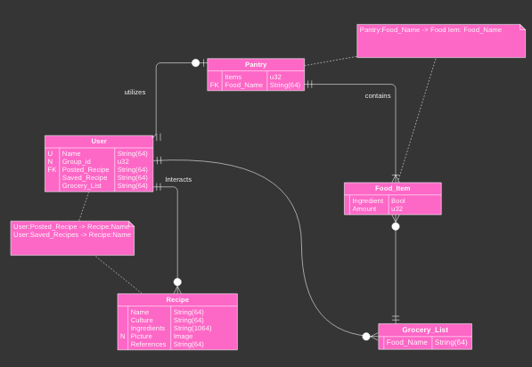
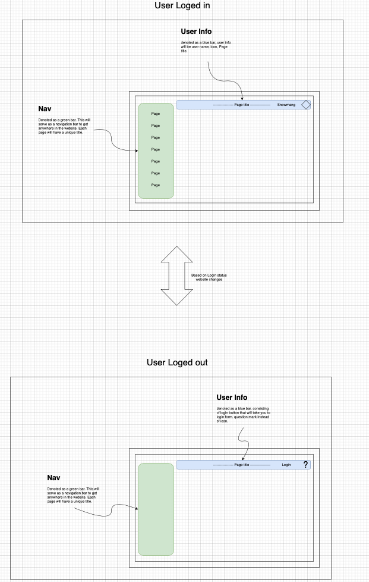

# Culinary Ocean

## Core attributes
- recipe database, cookbook social network.
- individual accounts for each person.
- family/friend groups.
- data: recipes, profiles, food pantry.

## Requirements
- use Vue.js on all pages to auto update
- use django to manage persisting data
- use foundation to style
- use rust wasm for image compression
- use Docker for hosting

## Stack
- Backend: actix-web + Docker + rust-trunk
- Middleware: actix-web/rust
- Frontend: rust-yew + tailwindcss

## Diagrams

database model using StarUML

Wireframe website using draw.io

- ~Model rust wasm in StarUML

## Roadmap
### Phase 1
- A website consisting of users.
- users can post a recipe.
- a recipe will consist of list of ingredients, and cooking process.
- This will need a database that will persist users, and the recipes.
### Phase 2
- users can separate themselves by viewable groups(friends, family)
- users will be able to add a picture to there recipes.
### Phase 3
- users can make posts viewable only to certain groups.
- users can make comments and react to posts with either preset options or hand written reactions.
